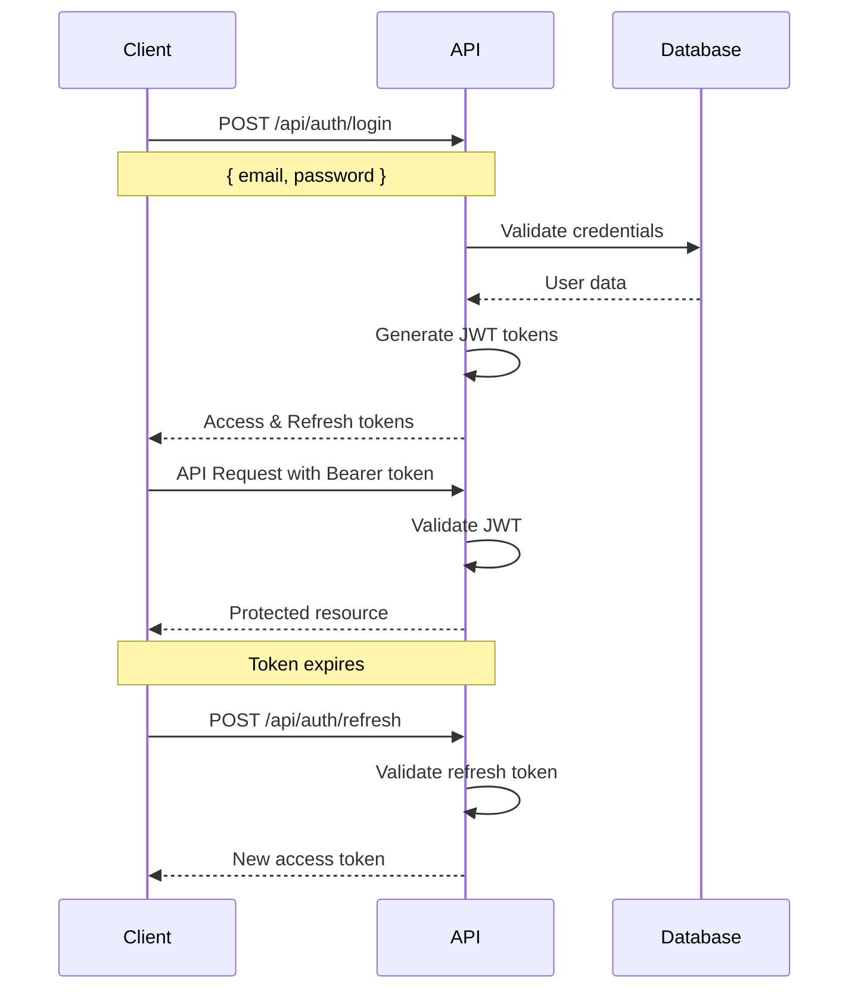

# 🔐 API Security Guide

## Overview

This guide provides comprehensive information about the security measures implemented in the Academic Management Portal API, including authentication, authorization, input validation, and best practices for secure API usage.

## 🛡️ Security Architecture

### 1. Multi-Layer Security Approach

```
┌─────────────────────────────────────────────────────────────┐
│                    Client Application                        │
└─────────────────────┬───────────────────────────────────────┘
                      │ HTTPS/TLS 1.3
┌─────────────────────▼───────────────────────────────────────┐
│                 Load Balancer/CDN                           │
│              (DDoS Protection, WAF)                         │
└─────────────────────┬───────────────────────────────────────┘
                      │
┌─────────────────────▼───────────────────────────────────────┐
│                 API Gateway                                 │
│        (Rate Limiting, Request Validation)                  │
└─────────────────────┬───────────────────────────────────────┘
                      │
┌─────────────────────▼───────────────────────────────────────┐
│              Security Middleware Layer                      │
│   • Request Fingerprinting  • Input Sanitization          │
│   • SQL Injection Prevention • XSS Protection              │
│   • CSRF Protection         • Security Headers             │
└─────────────────────┬───────────────────────────────────────┘
                      │
┌─────────────────────▼───────────────────────────────────────┐
│            Authentication & Authorization                   │
│   • JWT Token Validation   • Role-Based Access Control     │
│   • Session Management     • Permission Verification       │
└─────────────────────┬───────────────────────────────────────┘
                      │
┌─────────────────────▼───────────────────────────────────────┐
│                Business Logic Layer                         │
│              (Controllers & Services)                       │
└─────────────────────┬───────────────────────────────────────┘
                      │
┌─────────────────────▼───────────────────────────────────────┐
│                 Database Layer                              │
│        (MongoDB with Security Configuration)               │
└─────────────────────────────────────────────────────────────┘
```

## 🔑 Authentication & Authorization

### 1. JWT Token-Based Authentication

#### **Token Structure**:
```javascript
// Access Token (15 minutes)
{
  "header": {
    "alg": "HS256",
    "typ": "JWT"
  },
  "payload": {
    "userId": "507f1f77bcf86cd799439011",
    "email": "user@example.com",
    "role": "student",
    "firstName": "John",
    "lastName": "Doe",
    "iat": 1642248000,
    "exp": 1642248900
  }
}

// Refresh Token (7 days)
{
  "userId": "507f1f77bcf86cd799439011",
  "tokenVersion": 1,
  "iat": 1642248000,
  "exp": 1642852800
}
```

#### **Authentication Flow**:


### 2. Role-Based Access Control (RBAC)

#### **Role Hierarchy**:
```javascript
const roleHierarchy = {
  admin: {
    permissions: ['*'], // All permissions
    inherits: []
  },
  faculty: {
    permissions: [
      'courses.read',
      'courses.create',
      'courses.update',
      'assignments.create',
      'assignments.update',
      'assignments.grade',
      'students.read',
      'marks.create',
      'marks.update',
      'attendance.create',
      'attendance.update'
    ],
    inherits: []
  },
  student: {
    permissions: [
      'profile.read',
      'profile.update',
      'courses.read',
      'assignments.read',
      'assignments.submit',
      'marks.read',
      'attendance.read'
    ],
    inherits: []
  }
};
```

#### **Permission Validation**:
```javascript
// Middleware example
const requirePermission = (permission) => {
  return (req, res, next) => {
    const userRole = req.user.role;
    const userPermissions = roleHierarchy[userRole].permissions;
    
    if (userPermissions.includes('*') || userPermissions.includes(permission)) {
      return next();
    }
    
    return res.status(403).json({
      success: false,
      message: 'Insufficient permissions',
      code: 'FORBIDDEN'
    });
  };
};
```

## 🔒 Input Validation & Sanitization

### 1. Validation Layers

#### **Client-Side Validation** (First Layer):
```javascript
// Example: Registration form validation
const validateRegistration = (data) => {
  const errors = {};
  
  // Email validation
  if (!data.email || !/^[^\s@]+@[^\s@]+\.[^\s@]+$/.test(data.email)) {
    errors.email = 'Valid email is required';
  }
  
  // Password strength
  if (!data.password || data.password.length < 8) {
    errors.password = 'Password must be at least 8 characters';
  }
  
  return {
    isValid: Object.keys(errors).length === 0,
    errors
  };
};
```

#### **Server-Side Validation** (Second Layer):
```javascript
// Enhanced validation with express-validator
const registerValidation = [
  body('email')
    .isEmail()
    .normalizeEmail()
    .custom(async (email) => {
      const existingUser = await User.findOne({ email });
      if (existingUser) {
        throw new Error('Email already registered');
      }
    }),
  
  body('password')
    .isLength({ min: 8, max: 128 })
    .matches(/^(?=.*[a-z])(?=.*[A-Z])(?=.*\d)(?=.*[@$!%*?&])/)
    .withMessage('Password must contain uppercase, lowercase, number, and special character'),
  
  body('firstName')
    .trim()
    .isLength({ min: 2, max: 50 })
    .matches(/^[a-zA-Z\s.'-]+$/)
    .withMessage('Invalid first name format')
];
```

#### **Database Validation** (Third Layer):
```javascript
// Mongoose schema validation
const userSchema = new mongoose.Schema({
  email: {
    type: String,
    required: [true, 'Email is required'],
    unique: true,
    lowercase: true,
    validate: {
      validator: function(email) {
        return /^[^\s@]+@[^\s@]+\.[^\s@]+$/.test(email);
      },
      message: 'Invalid email format'
    }
  },
  password: {
    type: String,
    required: [true, 'Password is required'],
    minlength: [8, 'Password must be at least 8 characters'],
    validate: {
      validator: function(password) {
        return /^(?=.*[a-z])(?=.*[A-Z])(?=.*\d)(?=.*[@$!%*?&])/.test(password);
      },
      message: 'Password must meet complexity requirements'
    }
  }
});
```

### 2. Input Sanitization

#### **XSS Prevention**:
```javascript
const sanitizeInput = (req, res, next) => {
  const sanitizeObject = (obj) => {
    for (const [key, value] of Object.entries(obj)) {
      if (typeof value === 'string') {
        // Remove HTML tags and dangerous characters
        obj[key] = DOMPurify.sanitize(value, { 
          ALLOWED_TAGS: [],
          ALLOWED_ATTR: []
        }).trim();
      } else if (typeof value === 'object' && value !== null) {
        sanitizeObject(value);
      }
    }
  };
  
  if (req.body) sanitizeObject(req.body);
  if (req.query) sanitizeObject(req.query);
  if (req.params) sanitizeObject(req.params);
  
  next();
};
```

#### **SQL Injection Prevention**:
```javascript
const preventSQLInjection = (req, res, next) => {
  const sqlPatterns = [
    /('|(\\')|(;)|(\\;)|(\\|)|(\\*)|(%27)|(%3B)|(%3D)|(%2B)|(%20))/i,
    /(union|select|insert|delete|update|drop|create|alter|exec)/i,
    /(script|javascript|vbscript|onload|onerror|onclick)/i
  ];
  
  const checkForSQL = (obj) => {
    if (typeof obj === 'string') {
      return sqlPatterns.some(pattern => pattern.test(obj));
    }
    if (typeof obj === 'object' && obj !== null) {
      return Object.values(obj).some(value => checkForSQL(value));
    }
    return false;
  };
  
  if ([req.body, req.query, req.params].some(data => data && checkForSQL(data))) {
    return res.status(400).json({
      success: false,
      message: 'Invalid request format',
      code: 'INVALID_REQUEST'
    });
  }
  
  next();
};
```

## 🚦 Rate Limiting & DDoS Protection

### 1. Multi-Tier Rate Limiting

#### **Global Rate Limiting**:
```javascript
const globalRateLimit = rateLimit({
  windowMs: 15 * 60 * 1000, // 15 minutes
  max: 1000, // 1000 requests per window
  message: {
    success: false,
    message: 'Too many requests from this IP',
    code: 'RATE_LIMIT_EXCEEDED'
  },
  standardHeaders: true,
  legacyHeaders: false
});
```

#### **Endpoint-Specific Rate Limiting**:
```javascript
const endpointLimits = {
  // Authentication endpoints
  '/api/auth/login': {
    windowMs: 15 * 60 * 1000,
    max: 5, // 5 login attempts per 15 minutes
    skipSuccessfulRequests: true
  },
  
  // Registration endpoints
  '/api/auth/register': {
    windowMs: 60 * 60 * 1000,
    max: 3, // 3 registration attempts per hour
    skipSuccessfulRequests: false
  },
  
  // File upload endpoints
  '/api/*/upload': {
    windowMs: 10 * 60 * 1000,
    max: 20, // 20 uploads per 10 minutes
    skipSuccessfulRequests: true
  }
};
```

#### **Progressive Delay Implementation**:
```javascript
const progressiveDelay = slowDown({
  windowMs: 15 * 60 * 1000,
  delayAfter: 10, // Start delaying after 10 requests
  delayMs: 500, // Initial delay of 500ms
  maxDelayMs: 20000, // Maximum delay of 20 seconds
  skipSuccessfulRequests: true
});
```

### 2. DDoS Protection Strategies

#### **Request Pattern Analysis**:
```javascript
const ddosProtection = {
  // Detect rapid-fire requests
  detectRapidRequests: (req) => {
    const clientIP = req.ip;
    const now = Date.now();
    const timeWindow = 1000; // 1 second
    const maxRequests = 10;
    
    if (!requestCounts[clientIP]) {
      requestCounts[clientIP] = [];
    }
    
    // Clean old requests
    requestCounts[clientIP] = requestCounts[clientIP]
      .filter(timestamp => now - timestamp < timeWindow);
    
    // Add current request
    requestCounts[clientIP].push(now);
    
    return requestCounts[clientIP].length > maxRequests;
  },
  
  // Detect distributed attacks
  detectDistributedAttack: () => {
    const now = Date.now();
    const timeWindow = 60000; // 1 minute
    const threshold = 1000; // 1000 requests per minute globally
    
    const recentRequests = globalRequestLog
      .filter(timestamp => now - timestamp < timeWindow);
    
    return recentRequests.length > threshold;
  }
};
```

## 🔍 Security Monitoring & Logging

### 1. Security Event Logging

#### **Log Categories**:
```javascript
const securityEvents = {
  AUTHENTICATION: {
    LOGIN_SUCCESS: 'auth.login.success',
    LOGIN_FAILURE: 'auth.login.failure',
    LOGOUT: 'auth.logout',
    TOKEN_REFRESH: 'auth.token.refresh',
    PASSWORD_CHANGE: 'auth.password.change'
  },
  
  AUTHORIZATION: {
    ACCESS_GRANTED: 'authz.access.granted',
    ACCESS_DENIED: 'authz.access.denied',
    PRIVILEGE_ESCALATION: 'authz.privilege.escalation'
  },
  
  SECURITY_VIOLATIONS: {
    SQL_INJECTION_ATTEMPT: 'security.sql_injection',
    XSS_ATTEMPT: 'security.xss_attempt',
    RATE_LIMIT_EXCEEDED: 'security.rate_limit',
    SUSPICIOUS_ACTIVITY: 'security.suspicious_activity'
  },
  
  DATA_ACCESS: {
    SENSITIVE_DATA_ACCESS: 'data.sensitive.access',
    BULK_DATA_EXPORT: 'data.bulk.export',
    UNAUTHORIZED_ACCESS: 'data.unauthorized.access'
  }
};
```

#### **Structured Logging Format**:
```javascript
const logSecurityEvent = (event, details, req) => {
  const logEntry = {
    timestamp: new Date().toISOString(),
    event: event,
    severity: getSeverityLevel(event),
    source: {
      ip: req.ip,
      userAgent: req.get('User-Agent'),
      referer: req.get('Referer'),
      method: req.method,
      path: req.path,
      fingerprint: req.fingerprint
    },
    user: {
      id: req.user?.userId || null,
      email: req.user?.email || null,
      role: req.user?.role || null
    },
    details: details,
    correlationId: req.correlationId || generateCorrelationId()
  };
  
  // Send to appropriate log destination
  if (logEntry.severity === 'CRITICAL') {
    alertingSystem.sendAlert(logEntry);
  }
  
  securityLogger.log(logEntry);
};
```

### 2. Real-Time Monitoring

#### **Security Metrics Dashboard**:
```javascript
const securityMetrics = {
  realTimeStats: {
    activeUsers: 0,
    requestsPerSecond: 0,
    errorRate: 0,
    blockedRequests: 0
  },
  
  threatIndicators: {
    suspiciousIPs: [],
    failedLoginAttempts: 0,
    rateLimitViolations: 0,
    maliciousPayloads: 0
  },
  
  systemHealth: {
    responseTime: 0,
    memoryUsage: 0,
    cpuUsage: 0,
    databaseConnections: 0
  }
};
```

#### **Automated Alert System**:
```javascript
const alertingRules = {
  // Critical alerts
  criticalAlerts: [
    {
      condition: 'failedLoginAttempts > 10 in 5 minutes',
      action: 'lockAccount',
      notification: ['email', 'sms', 'slack']
    },
    {
      condition: 'errorRate > 5% for 2 minutes',
      action: 'enableMaintenanceMode',
      notification: ['email', 'pagerduty']
    }
  ],
  
  // Warning alerts
  warningAlerts: [
    {
      condition: 'responseTime > 2000ms for 5 minutes',
      action: 'scaleResources',
      notification: ['email']
    },
    {
      condition: 'suspiciousActivity detected',
      action: 'enhancedLogging',
      notification: ['slack']
    }
  ]
};
```

## 🛡️ API Security Best Practices

### 1. Secure API Design

#### **RESTful Security Principles**:
```javascript
// ✅ Good: Resource-based URLs with proper HTTP methods
GET    /api/users/123           // Get user
PUT    /api/users/123           // Update user
DELETE /api/users/123           // Delete user
POST   /api/users               // Create user

// ❌ Bad: Action-based URLs
GET    /api/getUser?id=123
POST   /api/updateUser
POST   /api/deleteUser
```

#### **Secure Response Headers**:
```javascript
const securityHeaders = {
  'X-Content-Type-Options': 'nosniff',
  'X-Frame-Options': 'DENY',
  'X-XSS-Protection': '1; mode=block',
  'Strict-Transport-Security': 'max-age=31536000; includeSubDomains',
  'Content-Security-Policy': "default-src 'self'",
  'Referrer-Policy': 'strict-origin-when-cross-origin',
  'Permissions-Policy': 'geolocation=(), microphone=(), camera=()'
};
```

### 2. Data Protection

#### **Sensitive Data Handling**:
```javascript
// ✅ Good: Remove sensitive fields from responses
const sanitizeUserData = (user) => {
  const { password, resetToken, ...safeData } = user.toObject();
  return safeData;
};

// ✅ Good: Encrypt sensitive data at rest
const encryptSensitiveField = (data) => {
  const cipher = crypto.createCipher('aes-256-cbc', process.env.ENCRYPTION_KEY);
  let encrypted = cipher.update(data, 'utf8', 'hex');
  encrypted += cipher.final('hex');
  return encrypted;
};
```

#### **Data Validation Rules**:
```javascript
const dataValidationRules = {
  // Personal Information
  email: {
    required: true,
    format: 'email',
    maxLength: 254,
    sanitize: true
  },
  
  phone: {
    required: true,
    format: /^[+]?[\d\s\-()]{10,15}$/,
    sanitize: true
  },
  
  // Academic Information
  rollNumber: {
    required: true,
    format: /^[A-Z0-9]{6,15}$/,
    unique: true,
    sanitize: true
  },
  
  // File Uploads
  profilePicture: {
    allowedTypes: ['image/jpeg', 'image/png', 'image/webp'],
    maxSize: 2 * 1024 * 1024, // 2MB
    virusScan: true
  }
};
```

### 3. Error Handling Security

#### **Secure Error Responses**:
```javascript
// ✅ Good: Generic error messages in production
const handleError = (error, req, res) => {
  const isProduction = process.env.NODE_ENV === 'production';
  
  // Log detailed error for debugging
  logger.error('API Error:', {
    message: error.message,
    stack: error.stack,
    path: req.path,
    method: req.method,
    user: req.user?.email,
    ip: req.ip
  });
  
  // Send sanitized error to client
  const clientError = {
    success: false,
    message: isProduction ? 'An error occurred' : error.message,
    code: error.code || 'INTERNAL_ERROR',
    timestamp: new Date().toISOString()
  };
  
  // Don't expose stack traces in production
  if (!isProduction && error.stack) {
    clientError.stack = error.stack;
  }
  
  res.status(error.statusCode || 500).json(clientError);
};
```

## 🔐 API Security Testing

### 1. Security Test Categories

#### **Authentication Testing**:
```javascript
describe('Authentication Security', () => {
  test('should reject invalid JWT tokens', async () => {
    const response = await request(app)
      .get('/api/auth/profile')
      .set('Authorization', 'Bearer invalid_token');
    
    expect(response.status).toBe(401);
    expect(response.body.code).toBe('UNAUTHORIZED');
  });
  
  test('should prevent brute force attacks', async () => {
    const loginAttempts = Array(6).fill().map(() => 
      request(app)
        .post('/api/auth/login')
        .send({ email: 'test@example.com', password: 'wrong' })
    );
    
    const responses = await Promise.all(loginAttempts);
    const lastResponse = responses[responses.length - 1];
    
    expect(lastResponse.status).toBe(429);
    expect(lastResponse.body.code).toBe('RATE_LIMIT_EXCEEDED');
  });
});
```

#### **Input Validation Testing**:
```javascript
describe('Input Validation Security', () => {
  test('should prevent XSS attacks', async () => {
    const xssPayload = '<script>alert("xss")</script>';
    
    const response = await request(app)
      .post('/api/auth/register')
      .send({
        firstName: xssPayload,
        email: 'test@example.com',
        password: 'ValidPass123!'
      });
    
    expect(response.status).toBe(400);
    expect(response.body.code).toBe('VALIDATION_ERROR');
  });
  
  test('should prevent SQL injection', async () => {
    const sqlPayload = "'; DROP TABLE users; --";
    
    const response = await request(app)
      .post('/api/auth/login')
      .send({
        email: sqlPayload,
        password: 'password'
      });
    
    expect(response.status).toBe(400);
    expect(response.body.code).toBe('INVALID_REQUEST');
  });
});
```

### 2. Automated Security Testing

#### **Security Test Pipeline**:
```yaml
# .github/workflows/security-tests.yml
name: Security Tests

on: [push, pull_request]

jobs:
  security-tests:
    runs-on: ubuntu-latest
    
    steps:
    - uses: actions/checkout@v2
    
    - name: Setup Node.js
      uses: actions/setup-node@v2
      with:
        node-version: '18'
    
    - name: Install dependencies
      run: npm ci
    
    - name: Run security audit
      run: npm audit --audit-level=moderate
    
    - name: Run SAST scan
      run: npm run security:sast
    
    - name: Run dependency check
      run: npm run security:deps
    
    - name: Run API security tests
      run: npm run test:security
```

## 📊 Security Compliance

### 1. Compliance Standards

#### **OWASP Top 10 Compliance**:
```javascript
const owaspCompliance = {
  'A01:2021 – Broken Access Control': {
    status: 'COMPLIANT',
    measures: [
      'Role-based access control',
      'JWT token validation',
      'Resource-level permissions',
      'Admin privilege separation'
    ]
  },
  
  'A02:2021 – Cryptographic Failures': {
    status: 'COMPLIANT',
    measures: [
      'HTTPS enforcement',
      'Password hashing with bcrypt',
      'JWT token encryption',
      'Sensitive data encryption at rest'
    ]
  },
  
  'A03:2021 – Injection': {
    status: 'COMPLIANT',
    measures: [
      'Input validation and sanitization',
      'Parameterized queries (Mongoose)',
      'SQL injection prevention middleware',
      'XSS protection'
    ]
  }
  // ... other OWASP categories
};
```

#### **GDPR Compliance Features**:
```javascript
const gdprCompliance = {
  dataProtection: {
    encryption: 'AES-256 encryption for sensitive data',
    anonymization: 'User data anonymization on request',
    pseudonymization: 'User ID pseudonymization in logs'
  },
  
  userRights: {
    dataAccess: 'GET /api/auth/profile/data-export',
    dataPortability: 'JSON export of user data',
    dataErasure: 'DELETE /api/auth/profile/delete-account',
    dataRectification: 'PUT /api/auth/profile'
  },
  
  consent: {
    tracking: 'Explicit consent for analytics',
    marketing: 'Opt-in for marketing communications',
    cookies: 'Cookie consent management'
  }
};
```

## 🚀 Security Deployment Checklist

### Pre-Deployment Security Verification

- [ ] **Authentication & Authorization**
  - [ ] JWT secrets are strong (32+ characters)
  - [ ] Token expiration times are appropriate
  - [ ] Role-based access control is implemented
  - [ ] Session management is secure

- [ ] **Input Validation & Sanitization**
  - [ ] All inputs are validated server-side
  - [ ] XSS protection is enabled
  - [ ] SQL injection prevention is active
  - [ ] File upload restrictions are in place

- [ ] **Rate Limiting & DDoS Protection**
  - [ ] Rate limiting is configured for all endpoints
  - [ ] Progressive delays are implemented
  - [ ] DDoS protection measures are active
  - [ ] Monitoring and alerting are configured

- [ ] **Security Headers & HTTPS**
  - [ ] HTTPS is enforced in production
  - [ ] Security headers are configured
  - [ ] CORS is properly configured
  - [ ] CSP policies are implemented

- [ ] **Logging & Monitoring**
  - [ ] Security event logging is active
  - [ ] Real-time monitoring is configured
  - [ ] Alert systems are operational
  - [ ] Log retention policies are set

- [ ] **Data Protection**
  - [ ] Sensitive data is encrypted
  - [ ] Database security is configured
  - [ ] Backup encryption is enabled
  - [ ] Data retention policies are implemented

### Post-Deployment Security Monitoring

- [ ] **Daily Monitoring**
  - [ ] Review security logs
  - [ ] Check authentication metrics
  - [ ] Monitor error rates
  - [ ] Verify system performance

- [ ] **Weekly Security Tasks**
  - [ ] Security patch assessment
  - [ ] Vulnerability scanning
  - [ ] Access review and cleanup
  - [ ] Performance optimization

- [ ] **Monthly Security Review**
  - [ ] Security policy updates
  - [ ] Incident response testing
  - [ ] Compliance assessment
  - [ ] Security training updates

---

**Remember: Security is not a destination, but a continuous journey. Regular updates, monitoring, and improvements are essential for maintaining a secure API.**