# 🔄 COMPLETE WORKFLOW DOCUMENTATION

## 📋 Workflow Overview

This document provides comprehensive documentation for all user workflows in the Academic Management Portal, including detailed step-by-step processes for Admin, Faculty, and Student roles.

---

## 👑 ADMIN WORKFLOW

### 🚀 Admin Onboarding & Setup

#### Initial Admin Setup
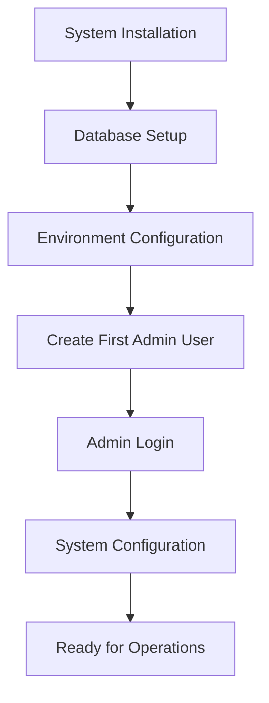

#### Step-by-Step Process:
1. **System Installation**
   - Install Node.js and MongoDB
   - Clone repository and install dependencies
   - Configure environment variables

2. **Database Setup**
   - Start MongoDB service
   - Create database and collections
   - Set up indexes and constraints

3. **First Admin Creation**
   - Run admin creation script
   - Set admin credentials
   - Verify admin access

4. **System Configuration**
   - Configure system settings
   - Set up email notifications
   - Configure file storage

### 📊 Daily Admin Operations

#### User Management Workflow
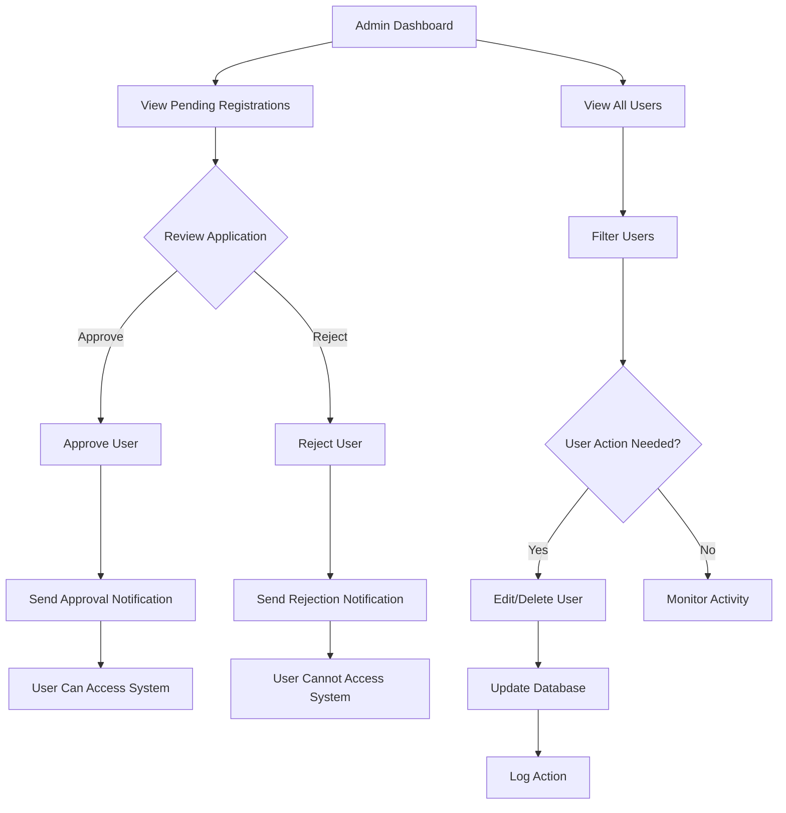

#### Detailed Steps:

**1. Review Pending Registrations**
```javascript
// Admin views pending registrations
GET /api/admin/users?status=pending

// Admin reviews each application
- Check user details
- Verify email and role
- Assess legitimacy
```

**2. Approve/Reject Users**
```javascript
// Approve user
PATCH /api/admin/users/:userId/approve

// Reject user (delete)
DELETE /api/admin/users/:userId

// System actions:
- Update user status
- Send notification email
- Create user profile
- Log admin action
```

**3. System Monitoring**
```javascript
// View system statistics
GET /api/admin/stats

// Monitor user activity
- Active users count
- Recent registrations
- System health metrics
- Database performance
```

### 🔧 System Administration

#### System Maintenance Workflow
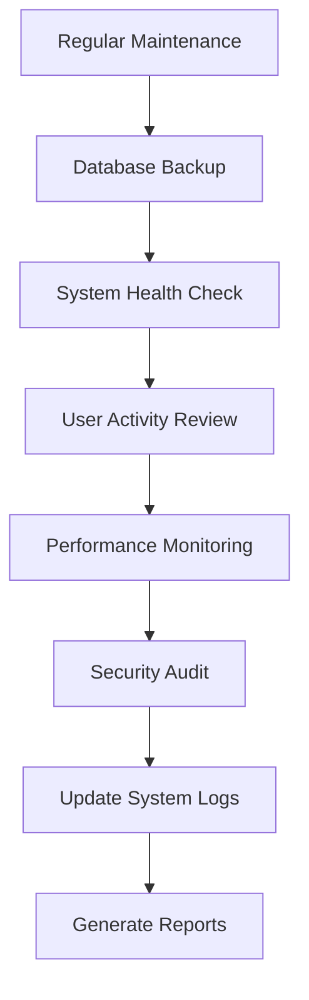

---

## 👨‍🏫 FACULTY WORKFLOW

### 📝 Faculty Registration & Onboarding

#### Faculty Registration Process
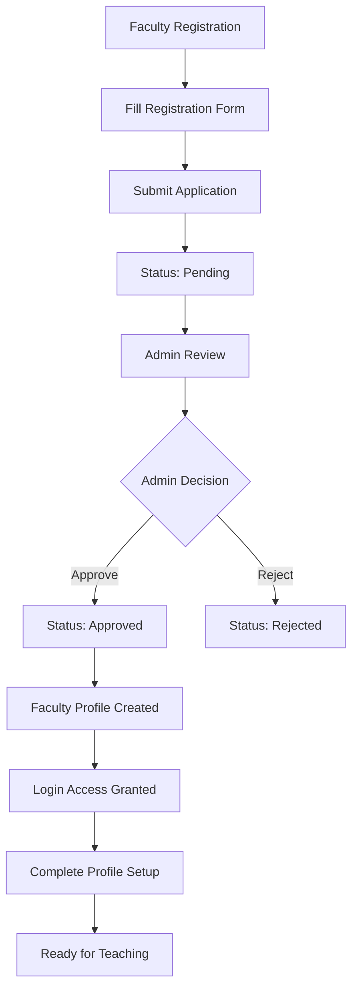

#### Registration Form Details:
```javascript
{
    "personalInfo": {
        "name": "Dr. John Smith",
        "email": "john.smith@university.edu",
        "phone": "+1-234-567-8900"
    },
    "academicInfo": {
        "designation": "Professor",
        "department": "Computer Science",
        "subjects": ["Data Structures", "Algorithms", "Database Systems"],
        "experience": "10 years",
        "qualifications": "PhD in Computer Science"
    },
    "credentials": {
        "password": "secure_password",
        "confirmPassword": "secure_password"
    }
}
```

### 🎓 Student Management Workflow

#### Student Assignment Process
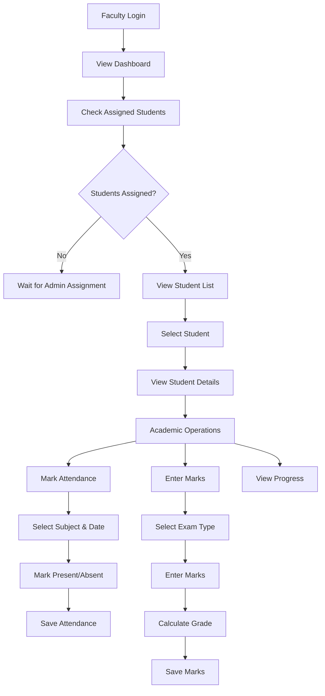

#### Daily Faculty Operations:

**1. Attendance Management**
```javascript
// View assigned students
GET /api/faculty/students

// Mark attendance for a student
POST /api/faculty/students/:studentId/attendance
{
    "subject": "Data Structures",
    "date": "2024-01-15",
    "status": "present",
    "classType": "lecture"
}

// View attendance records
GET /api/faculty/students/:studentId/attendance
```

**2. Marks Entry**
```javascript
// Add marks for a student
POST /api/faculty/students/:studentId/marks
{
    "subject": "Data Structures",
    "examType": "mid-term",
    "totalMarks": 85,
    "maxMarks": 100,
    "credits": 4
}

// View student marks
GET /api/faculty/students/:studentId/marks
```

### 📢 Communication & Resources

#### Notice Creation Workflow
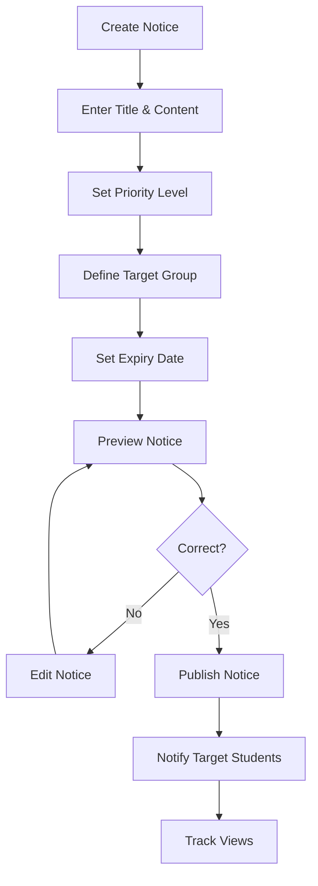

#### Resource Upload Workflow
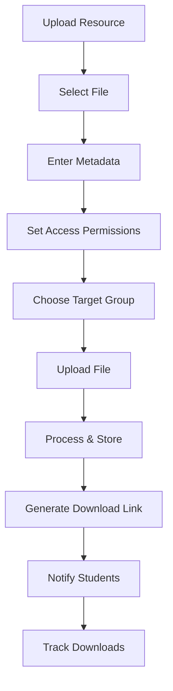

---

## 🎓 STUDENT WORKFLOW

### 📝 Student Registration & Onboarding

#### Student Registration Process
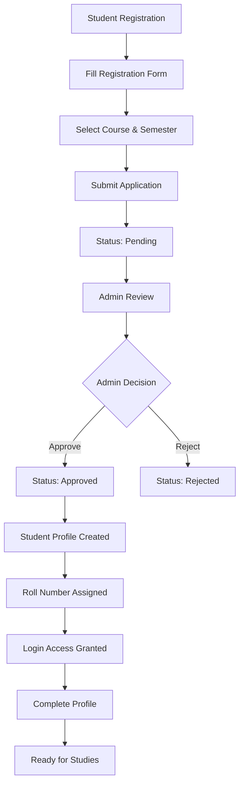

#### Registration Form Details:
```javascript
{
    "personalInfo": {
        "name": "Alice Johnson",
        "email": "alice.johnson@student.edu",
        "phone": "+1-234-567-8901"
    },
    "academicInfo": {
        "course": "B.Tech Computer Science",
        "semester": 3,
        "enrollmentYear": 2024,
        "previousEducation": "12th Grade - 85%"
    },
    "credentials": {
        "password": "secure_password",
        "confirmPassword": "secure_password"
    }
}
```

### 📊 Academic Tracking Workflow

#### Daily Student Activities
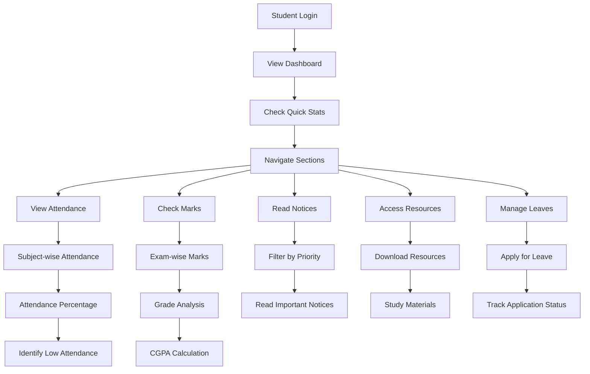

#### Academic Performance Tracking:

**1. Attendance Monitoring**
```javascript
// View own attendance
GET /api/student/attendance

// Response includes:
- Subject-wise attendance records
- Attendance percentages
- Low attendance warnings
- Class-wise breakdown
```

**2. Marks & Grade Tracking**
```javascript
// View own marks
GET /api/student/marks

// Response includes:
- Exam-wise marks
- Subject-wise performance
- Grade calculations
- CGPA updates
```

### 🏖️ Leave Application Workflow

#### Complete Leave Process
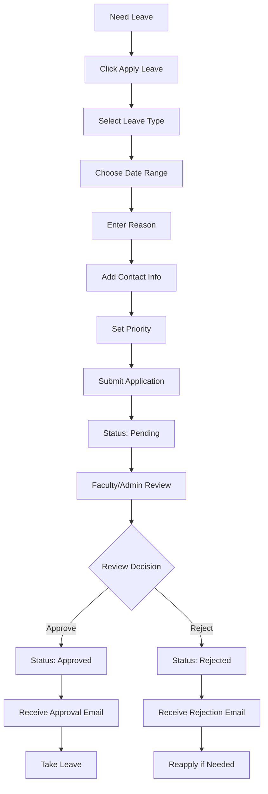

#### Leave Application Details:
```javascript
{
    "leaveType": "medical",
    "reason": "Medical appointment with specialist doctor",
    "fromDate": "2024-01-20",
    "toDate": "2024-01-22",
    "totalDays": 3,
    "priority": "urgent",
    "contactInfo": "9876543210",
    "supportingDocuments": "medical_certificate.pdf"
}
```

---

## 🔄 CROSS-ROLE WORKFLOWS

### 📢 Notice Distribution Workflow

#### Complete Notice Flow
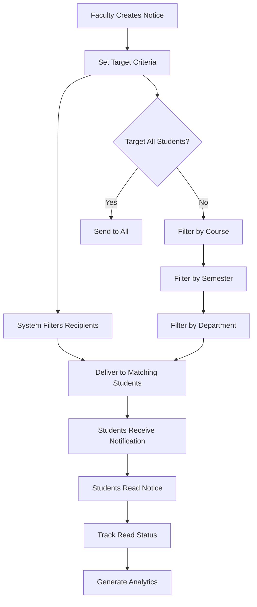

### 📚 Resource Sharing Workflow

#### Complete Resource Flow
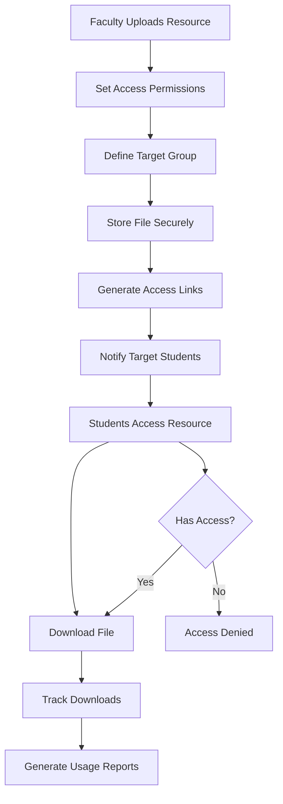

### 🏖️ Leave Review Workflow

#### Complete Leave Review Process
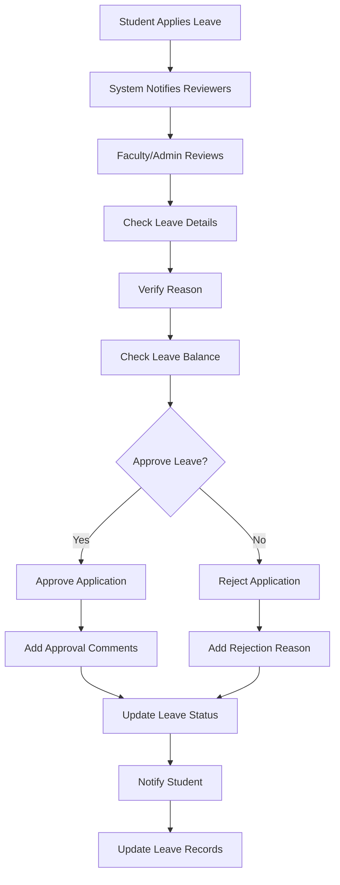

---

## 📊 WORKFLOW METRICS & MONITORING

### 📈 Performance Indicators

#### Admin Metrics:
- User approval time
- System response time
- Database performance
- Error rates
- Security incidents

#### Faculty Metrics:
- Student engagement
- Attendance marking frequency
- Marks entry timeliness
- Notice effectiveness
- Resource usage

#### Student Metrics:
- Login frequency
- Academic performance
- Attendance percentage
- Resource downloads
- Leave applications

### 🔍 Workflow Optimization

#### Continuous Improvement:
1. **Monitor Workflow Efficiency**
   - Track completion times
   - Identify bottlenecks
   - Measure user satisfaction

2. **Gather User Feedback**
   - Regular surveys
   - Usage analytics
   - Error reporting

3. **Implement Improvements**
   - Streamline processes
   - Reduce manual steps
   - Enhance user experience

4. **Regular Reviews**
   - Monthly workflow analysis
   - Quarterly optimization
   - Annual system review

---

## 🎯 WORKFLOW BEST PRACTICES

### ✅ Admin Best Practices:
- Review registrations within 24 hours
- Monitor system health daily
- Backup data regularly
- Maintain security protocols
- Document all major changes

### ✅ Faculty Best Practices:
- Mark attendance promptly
- Enter marks within deadline
- Create clear, informative notices
- Upload relevant resources
- Review leave applications quickly

### ✅ Student Best Practices:
- Check dashboard regularly
- Monitor attendance percentage
- Download resources promptly
- Apply for leaves in advance
- Keep profile information updated

**🔄 COMPLETE WORKFLOW DOCUMENTATION DELIVERED**